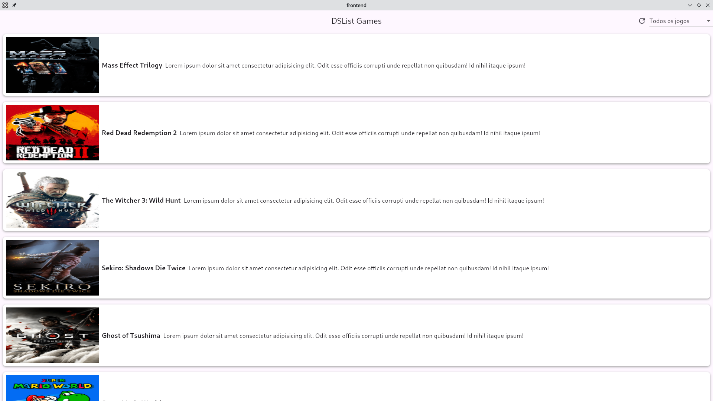
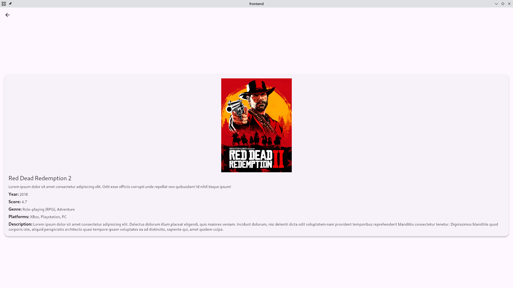

# Frontend - DSList Flutter

This document provides specific details about the Flutter frontend for the DSList project.

---

## 📖 - Index

1. [About This Project](#ℹ️---about-this-project)
2. [Architecture & Technologies](#️---architecture--technologies)
3. [How to Compile And Run](#---how-to-compile-and-run)
4. [Project Structure](#---project-structure)
5. [Screenshots](#️---screenshots)
6. [Credits](#---credits)

---

## ℹ️ - About This Project

This project is the frontend client for the [DSList](../README.md) application. It's a Flutter application designed to consume the Java Spring Boot REST API, providing a user interface to view and manage game lists.

This frontend was developed by Edoardo Fabrizio De Iovanna as a complementary part of the original backend course.

---

## 🛠️ - Architecture & Technologies

- **Language:** Dart
- **Framework:** Flutter
- **Architecture:** The project follows a pattern similar to MVVM (Model-View-ViewModel).
  - **Views:** Widgets that compose the UI.
  - **Controllers:** Manage the application's state and business logic, acting as a bridge between the Views and Repositories.
  - **Repositories:** Handle data operations, fetching data from the API.
  - **Models:** Represent the data structures (e.g., `GameModel`).
- **Key Dependencies:**
  - `dio`: Used for making HTTP requests to the backend API.
  - `auto_injector`: For dependency injection, decoupling the application's components.
  - `flutter_lints`: To enforce code style and quality.

---

## 🚀 - How to Compile And Run

### Prerequisites

- An installed and configured Flutter SDK.
- The [backend server](../README.md) must be running, as this application depends on its API. By default, the API is expected at `http://localhost:8080`.

### Steps

1. **Navigate to the frontend directory:**

   ```bash
   cd frontend
   ```

2. **Install dependencies:**

   ```bash
   flutter pub get
   ```

3. **Run the application:**

   ```bash
   flutter run
   ```

---

## 📂 - Project Structure

The `lib` folder is organized as follows:

- `lib/api/`: Contains the API client configuration (`dio`).
- `lib/config/`: Handles dependency injection setup (`auto_injector`).
- `lib/controllers/`: Contains the business logic and state management.
- `lib/models/`: Data models that mirror the backend entities.
- `lib/repositories/`: Classes responsible for abstracting data sources (API calls).
- `lib/views/`: UI widgets, pages, and components.
- `lib/main.dart`: The entry point of the application.

---

## 🖼️ - Screenshots

**Home Page**


**Game Detail Page**


---

## 🙏 - Credits

- **Edoardo Fabrizio De Iovanna:** Development and integration of the Flutter frontend.
